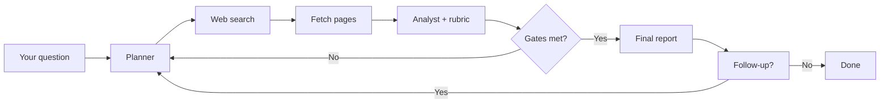

<p align="center">
  
</p>

<h1 align="center">Solid</h1>

<p align="center">
  <strong>Iterative deep research with an evidence score you can trust — not optimistic confidence.</strong>
</p>

<p align="center">
  <a href="LICENSE"></a>
  <a href="https://www.typescriptlang.org/"></a>
  <a href="https://react.dev/"></a>
  <a href="https://hono.dev/"></a>
  <a href="https://nodejs.org/"></a>
</p>

<p align="center">
  Plan → search → read → score → repeat until the evidence holds up.<br />
  Follow up in the same thread. Self-hostable. Any OpenAI-compatible LLM. UI in 7 languages.
</p>

<p align="center">
  Created by <a href="https://github.com/LuizEduPP"><strong>Luiz Eduardo</strong></a> (<a href="https://github.com/LuizEduPP">@LuizEduPP</a>)
</p>

<p align="center">
  <a href="#quick-start">Quick start</a> ·
  <a href="#features">Features</a> ·
  <a href="#how-it-works">How it works</a> ·
  <a href="#api">API</a> ·
  <a href="#author--attribution">Author</a> ·
  <a href="#license">License</a>
</p>

---

## Why Solid?

Most “research agents” stop when the model *feels* done. **Solid stops when the evidence meets explicit gates** — minimum iterations, diverse sources, closed gaps, and a mandatory **disconfirmation** pass before high scores stick.

You get a running **solidness score** (0–100) backed by a visible 4-part rubric, not a black-box “confidence” number.

| | Typical chat research | **Solid** |
| --- | --- | --- |
| Stop condition | Model decides | Score + rubric gates |
| Source quality | Often opaque | Domains, citations, gaps tracked |
| High scores | Easy to inflate | Capped with open gaps; disconfirmation required |
| Output | One blob of text | Iterations, steps log, exportable markdown report |
| Deepening | Start over | **Follow-up in the same session** with prior context |

---

## Features

- **Evidence-first agent loop** — plans angles, searches DuckDuckGo (lite + html backends), fetches page excerpts, updates a cumulative synthesis each iteration
- **Solidness panel** — ring score + 4-part rubric (evidence, sources, gaps, risks) with weak / building / solid status
- **Two research modes** — **Rigorous** (100% target) and **Fast** (85% target); toggle from the composer (⚡ icon)
- **Follow-up in the same thread** — after a report, ask to deepen a point; prior score, synthesis, gaps, queries, and citations carry over
- **ChatGPT-style UI** — collapsible sidebar (280px / 56px rail), session history, centered empty-state composer, sticky solidness bar, glass footer
- **Streaming research** — live steps drawer, stop/cancel mid-run (abort signal), scroll-aware solidness pin
- **Bring your own LLM** — OpenAI, Ollama, LM Studio, or any `/v1` compatible endpoint (default model: `gpt-4o-mini`, temperature `0.3`)
- **OpenAI-compatible API** — drop-in `POST /v1/chat/completions` with `model: "solid"`
- **7 UI languages** — English, Español, Português (BR/PT), Français, Deutsch, Italiano
- **Local-first sessions** — history (`solid-history`) + settings (`solid-settings`) in `localStorage`, markdown export per session

---

## Quick start

**Prerequisites:** Node.js 20+, [Yarn](https://yarnpkg.com/)

```bash
git clone https://github.com/LuizEduPP/solid.git
cd solid
yarn install
yarn dev
```

| Service | URL |
| --- | --- |
| **Web UI** | [http://localhost:5173](http://localhost:5173) |
| **API** | [http://localhost:8787](http://localhost:8787) |
| **Health** | [http://localhost:8787/health](http://localhost:8787/health) |

### 1. Configure your LLM

Open **Settings** in the sidebar:

| Field | Example (local) | Example (OpenAI) |
| --- | --- | --- |
| API key | *(empty for local)* | `sk-...` |
| Base URL | `http://127.0.0.1:1234/v1` | `https://api.openai.com/v1` |
| Model | your local model id | `gpt-4o-mini` |

### 2. Ask a question

Type a research objective and submit. Watch iterations, rubric scores, and the final markdown report stream in.

### 3. Follow up (optional)

After a report finishes, stay in the same chat and ask something like *“deepen point X from the report”*. Solid continues from the prior synthesis, score, gaps, and sources instead of starting over.

### Production build

```bash
yarn build
yarn start
```

Serves the built UI from the API when `NODE_ENV=production`. Optional `.env`:

```bash
cp .env.example .env
# PORT=8787
# FAVICON_CACHE_DIR=cache/favicons
```

---

## Research modes

Thresholds are defined in `src/shared.ts` (`MODE_THRESHOLDS`).

| Mode | Target score | Min. iterations | Min. unique domains | Max score Δ / iter | 1st iteration cap | Disconfirm at ≥ |
| --- | ---: | ---: | ---: | ---: | ---: | ---: |
| **Rigorous** | 100% | 6 | 5 | 6 | 40% | 70% |
| **Fast** | 85% | 3 | 3 | 12 | 55% | 80% |

Toggle modes with the ⚡ icon in the composer (saved in browser settings).

To reach the target score, **all** gates must pass: no open gaps, minimum iterations, minimum unique domains, and at least one disconfirming search round.

---

## How it works



Each iteration:

1. **Plan** — new angle or disconfirmation query (forced when score crosses the mode threshold and no disconfirming round yet)
2. **Search** — DuckDuckGo via `@phukon/duckduckgo-search` (lite + html backends, 2.5s throttle, up to 5 retries on rate limits)
3. **Read** — up to **3 pages** per iteration (~**3,500** chars each, 8s fetch timeout); **8** search hits per query
4. **Score** — hybrid cumulative update (55% model / 45% rubric blend) with per-iteration caps, gap penalties, and domain caps
5. **Gate** — continue until all mode thresholds pass **or** the analyst sets `should_continue: false`

**Scoring highlights**

- Rubric: 4 × 0–25 (`direct_evidence`, `source_diversity`, `gap_coverage`, `risk_contradiction`)
- Hybrid cumulative score blended with objective signals (unique domains, citations, iterations, open gaps)
- Scores **>90** capped at **90** unless **≥3 cited domains** (`capScoreForCitedDomains`)
- Scores capped at **94** while open gaps remain
- Target score blocked while critical gaps remain, minimum iterations/domains are unmet, or disconfirmation is missing

Agent reasoning and reports follow **the language of your question**. The app UI is translated separately via i18n.

---

## API

OpenAI-compatible routes under `/v1`:

| Method | Path | Purpose |
| --- | --- | --- |
| `POST` | `/v1/chat/completions` | Run research (streaming or not) |
| `POST` | `/v1/llm/models` | List models from your LLM provider |
| `GET` | `/v1/models` | List Solid as a model (`solid`) |
| `GET` | `/health` | Health check |
| `GET` | `/favicons/:hostname` | Cached favicon for a source domain |

### New research (streaming)

```bash
curl -N http://localhost:8787/v1/chat/completions \
  -H "Content-Type: application/json" \
  -d '{
    "model": "solid",
    "stream": true,
    "research_mode": "rigorous",
    "llm_api_key": "",
    "llm_base_url": "http://127.0.0.1:1234/v1",
    "llm_model": "your-model-id",
    "messages": [{"role": "user", "content": "What evidence supports X?"}]
  }'
```

### Follow-up in the same session

Send the follow-up as the user message and include `prior_context` from the previous run:

```bash
curl -N http://localhost:8787/v1/chat/completions \
  -H "Content-Type: application/json" \
  -d '{
    "model": "solid",
    "stream": true,
    "research_mode": "rigorous",
    "llm_api_key": "",
    "llm_base_url": "http://127.0.0.1:1234/v1",
    "llm_model": "your-model-id",
    "messages": [{"role": "user", "content": "Deepen the regulatory risks section"}],
    "prior_context": {
      "rootObjective": "What evidence supports X?",
      "followUp": "Deepen the regulatory risks section",
      "cumulativeSynthesis": "...",
      "currentScore": 72.5,
      "report": "...",
      "openGaps": ["..."],
      "priorQueries": ["..."],
      "citedUrls": ["https://..."],
      "uniqueDomainCount": 4,
      "iterationCount": 3,
      "hadDisconfirmingSearch": true
    }
  }'
```

**Request fields (optional unless noted):**

| Field | Default | Notes |
| --- | --- | --- |
| `research_mode` | `rigorous` | `rigorous` or `fast` |
| `target_score` | mode default (100 / 85) | Override target solidness |
| `min_score` | `0.01` | Floor for cumulative score |
| `temperature` | `0.3` | LLM temperature (0–2) |
| `prior_context` | — | Resume / follow-up from prior state |

**Stream markers in the assistant content:** `@@STATUS@@` · `@@SCORE@@` · `@@ITER@@` · `@@RUBRIC@@` · `@@REPORT@@`

---

## Stack

| Layer | Tech |
| --- | --- |
| **Runtime** | TypeScript, Node.js, ESM |
| **API** | Hono, `@hono/node-server`, OpenAI SDK, Zod |
| **Agent** | Custom loop, DuckDuckGo search (`@phukon/duckduckgo-search`), direct page fetch, `ai-json-repair` |
| **UI** | React 19, Vite 7, Mantine 9, react-router-dom |
| **Markdown** | react-markdown, remark-gfm, github-markdown-css |
| **i18n** | react-i18next (7 locales) |

---

## Project structure

```
public/              Static assets (logo)
src/client/          React app — UI, streaming, localStorage, locales
src/server/          Hono API — search, favicons, config
src/server/agent/    Agent loop, prompts, scoring, schemas, tests
src/shared.ts        Shared types, MODE_THRESHOLDS, PriorResearchContext, rubric helpers
```

---

## Scripts

```bash
yarn dev         # API + Vite (ports 8787 + 5173)
yarn build       # Production client + server compile
yarn start       # Run production server
yarn typecheck   # TypeScript (client + server)
yarn test        # Agent scoring & schema tests
```

---

## UI languages

English (default), Español, Português (Brasil), Português (Portugal), Français, Deutsch, Italiano — **Settings → Language**.

---

## Author & attribution

**Solid** was created by **[Luiz Eduardo](https://github.com/LuizEduPP)** ([@LuizEduPP](https://github.com/LuizEduPP)).

Official repository: **https://github.com/LuizEduPP/solid**

If you use, fork, modify, distribute, or **sell** this project (including SaaS or white-label):

- Keep the [LICENSE](LICENSE) and [NOTICE](NOTICE) files in your codebase and releases.
- Credit the original author in docs, landing pages, or an About/Credits screen, for example:

  > Based on [Solid](https://github.com/LuizEduPP/solid) by [Luiz Eduardo](https://github.com/LuizEduPP) ([@LuizEduPP](https://github.com/LuizEduPP))

Removing copyright notices from distributed copies **violates the MIT License**. See [NOTICE](NOTICE) for details.

---

## Contributing

Issues and PRs welcome. Before submitting:

1. `yarn typecheck && yarn test`
2. Keep README / `.env.example` in sync with behavior changes
3. Match existing code style (minimal scope, no drive-by refactors)

---

## License

[MIT](LICENSE) — commercial use allowed **with attribution**. See [NOTICE](NOTICE).

Copyright © 2026 [Luiz Eduardo](https://github.com/LuizEduPP).

---

<p align="center">
  If Solid helps your research workflow, star the <a href="https://github.com/LuizEduPP/solid">official repo</a> — it helps others find the original work.
</p>
