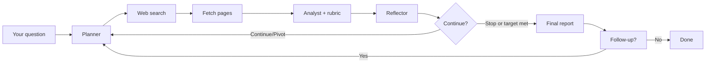

<p align="center">
  
</p>

<h1 align="center">Solid</h1>

<p align="center">
  <strong>Iterative deep research with an evidence score you can trust — not optimistic confidence.</strong>
</p>

<p align="center">
  <a href="LICENSE"></a>
  <a href="https://www.typescriptlang.org/"></a>
  <a href="https://react.dev/"></a>
  <a href="https://hono.dev/"></a>
  <a href="https://nodejs.org/"></a>
</p>

<p align="center">
  Plan → search → read → analyze → reflect → repeat until the evidence holds up.<br />
  Follow up in the same thread. Self-hostable. Any OpenAI-compatible LLM. UI in 7 languages.
</p>

<p align="center">
  Created by <a href="https://github.com/LuizEduPP"><strong>Luiz Eduardo</strong></a> (<a href="https://github.com/LuizEduPP">@LuizEduPP</a>)
</p>

<p align="center">
  <a href="#quick-start">Quick start</a> ·
  <a href="#features">Features</a> ·
  <a href="#how-it-works">How it works</a> ·
  <a href="#api">API</a> ·
  <a href="#author--attribution">Author</a> ·
  <a href="#license">License</a>
</p>

---

## Why Solid?

Most "research agents" stop when the model *feels* done. **Solid stops when the evidence meets explicit gates** — minimum iterations, diverse sources, closed gaps, and a mandatory **disconfirmation** pass before high scores stick.

A **Reflector LLM** reviews the entire investigation after each iteration, assessing entity existence, investigation quality, and whether to continue, pivot, or stop — replacing mechanical thresholds with genuine meta-cognitive reasoning.

You get a running **solidness score** (0–100) backed by a visible 4-part rubric, not a black-box "confidence" number.

| | Typical chat research | **Solid** |
| --- | --- | --- |
| Stop condition | Model decides | Score + rubric gates + reflector review |
| Entity verification | None | Reflector assesses existence with confidence % |
| Source quality | Often opaque | Domains, citations, gaps tracked per iteration |
| High scores | Easy to inflate | Capped with open gaps; disconfirmation required |
| Stagnation | Runs forever or stops abruptly | Reflector detects circular/exhausted research |
| Output | One blob of text | Iterations with evidence types, floating data panel, exportable report |
| Deepening | Start over | **Follow-up in the same session** with prior context |

---

## Features

- **Three-LLM agent loop** — Planner, Analyst, and Reflector collaborate each iteration to plan angles, analyze evidence, and decide whether to continue, pivot, or stop
- **Evidence classification** — each iteration is tagged as `direct`, `contextual`, or `none` evidence, with explicit disambiguation notes when similar entities are found
- **Entity verification** — the Reflector assesses whether the target entity exists (`confirmed` → `nonexistent`) with a confidence percentage and reasoning
- **Investigation quality tracking** — the Reflector classifies research quality as `progressing`, `stagnating`, `circular`, or `exhausted`
- **Floating data panel** — score ring, entity verdict, investigation quality, 4-part rubric bars, key observations, source list, iteration timeline, and open gaps — all in a floating overlay
- **Two research modes** — **Rigorous** (100% target, 6+ iterations) and **Fast** (85% target, 3+ iterations); toggle from the composer badge
- **Follow-up in the same thread** — after a report, ask to deepen a point; prior score, synthesis, gaps, queries, and citations carry over
- **Dynamic suggestions** — empty state shows LLM-generated research suggestions when a model is configured
- **Auto-generated titles** — chat sessions get concise LLM-generated titles automatically
- **Streaming research** — live iteration cards with evidence badges, score deltas, and disambiguation alerts
- **Bring your own LLM** — OpenAI, Ollama, LM Studio, or any `/v1` compatible endpoint (default model: `gpt-4o-mini`, temperature `0.3`)
- **OpenAI-compatible API** — drop-in `POST /v1/chat/completions` with `model: "solid"`
- **7 UI languages** — English, Español, Português (BR/PT), Français, Deutsch, Italiano
- **Local-first sessions** — history + settings in `localStorage`, markdown export per session

---

## Quick start

**Prerequisites:** Node.js 20+, npm

```bash
git clone https://github.com/LuizEduPP/solid.git
cd solid
npm install
npm run dev
```

| Service | URL |
| --- | --- |
| **Web UI** | [http://localhost:5173](http://localhost:5173) |
| **API** | [http://localhost:8787](http://localhost:8787) |
| **Health** | [http://localhost:8787/health](http://localhost:8787/health) |

### 1. Configure your LLM

Open **Settings** in the sidebar:

| Field | Example (local) | Example (OpenAI) |
| --- | --- | --- |
| API key | *(empty for local)* | `sk-...` |
| Base URL | `http://127.0.0.1:1234/v1` | `https://api.openai.com/v1` |
| Model | your local model id | `gpt-4o-mini` |

### 2. Ask a question

Type a research objective and submit. Watch iterations stream in with evidence classifications, score changes, and the final markdown report.

### 3. Follow up (optional)

After a report finishes, stay in the same chat and ask something like *"deepen point X from the report"*. Solid continues from the prior synthesis, score, gaps, and sources instead of starting over.

### Production build

```bash
npm run build
npm start
```

Serves the built UI from the API when `NODE_ENV=production`. Optional `.env`:

```bash
cp .env.example .env
# PORT=8787
# FAVICON_CACHE_DIR=cache/favicons
```

---

## Research modes

Thresholds are defined in `src/shared.ts` (`MODE_THRESHOLDS`).

| Mode | Target score | Min. iterations | Min. unique domains | Max score Δ / iter | 1st iteration cap | Disconfirm at ≥ |
| --- | ---: | ---: | ---: | ---: | ---: | ---: |
| **Rigorous** | 100% | 6 | 5 | 6 | 40% | 70% |
| **Fast** | 85% | 3 | 3 | 12 | 55% | 80% |

Toggle modes from the badge in the composer (saved in browser settings).

To reach the target score, **all** gates must pass: no open gaps, minimum iterations, minimum unique domains, and at least one disconfirming search round.

---

## How it works



Each iteration involves three LLM roles:

### 1. Planner
Plans the next search angle based on the objective, cumulative synthesis, open gaps, prior queries, and the Reflector's latest assessment. Decides whether to run a disconfirming search (forced when score crosses the mode threshold).

### 2. Analyst
Receives search results and page excerpts. Produces:
- **Iteration findings** and updated **cumulative synthesis**
- **Score rubric** (4 × 0–25: `direct_evidence`, `source_diversity`, `gap_coverage`, `risk_contradiction`)
- **Evidence type** classification (`direct` / `contextual` / `none`)
- **Entity evidence** assessment and **disambiguation notes**
- Updated **open gaps** and **resolved gaps**

### 3. Reflector (Supervisor)
Reviews the *entire* investigation holistically after each iteration:
- **Entity verdict**: `confirmed` | `likely` | `uncertain` | `unlikely` | `nonexistent` with confidence %
- **Investigation quality**: `progressing` | `stagnating` | `circular` | `exhausted`
- **Recommendation**: `continue` | `pivot` | `stop` with reasoning
- **Key observations** across all iterations

The Reflector can override the Analyst's `should_continue` — if the Analyst recommends stopping but the Reflector sees value in continuing, research proceeds.

### Scoring

- **Hybrid cumulative score**: blended from model assessment (55%) and objective rubric signals (45%)
- **Evidence score**: computed from unique domains, citations, iterations, and gap penalties (named constants in `scoring.ts`)
- Scores **>90** capped at **90** unless **≥3 cited domains**
- Scores capped at **94** while open gaps remain
- **Entity confidence cap**: when the Reflector's entity confidence drops below 50%, the score is capped proportionally
- Per-iteration delta capped at `maxScoreDelta`; score drops limited to 5 points (15 with contradiction)

---

## API

OpenAI-compatible routes under `/v1`:

| Method | Path | Purpose |
| --- | --- | --- |
| `POST` | `/v1/chat/completions` | Run research (streaming or not) |
| `POST` | `/v1/llm/models` | List models from your LLM provider |
| `POST` | `/v1/suggestions` | Generate research suggestion chips |
| `POST` | `/v1/title` | Generate a short title for a research session |
| `GET` | `/v1/models` | List Solid as a model (`solid`) |
| `GET` | `/health` | Health check |
| `GET` | `/favicons/:hostname` | Cached favicon for a source domain |

### New research (streaming)

```bash
curl -N http://localhost:8787/v1/chat/completions \
  -H "Content-Type: application/json" \
  -d '{
    "model": "solid",
    "stream": true,
    "research_mode": "rigorous",
    "llm_api_key": "",
    "llm_base_url": "http://127.0.0.1:1234/v1",
    "llm_model": "your-model-id",
    "messages": [{"role": "user", "content": "What evidence supports X?"}]
  }'
```

### Follow-up in the same session

Send the follow-up as the user message and include `prior_context` from the previous run:

```bash
curl -N http://localhost:8787/v1/chat/completions \
  -H "Content-Type: application/json" \
  -d '{
    "model": "solid",
    "stream": true,
    "research_mode": "rigorous",
    "llm_api_key": "",
    "llm_base_url": "http://127.0.0.1:1234/v1",
    "llm_model": "your-model-id",
    "messages": [{"role": "user", "content": "Deepen the regulatory risks section"}],
    "prior_context": {
      "rootObjective": "What evidence supports X?",
      "followUp": "Deepen the regulatory risks section",
      "cumulativeSynthesis": "...",
      "currentScore": 72.5,
      "report": "...",
      "openGaps": ["..."],
      "priorQueries": ["..."],
      "citedUrls": ["https://..."],
      "uniqueDomainCount": 4,
      "iterationCount": 3,
      "hadDisconfirmingSearch": true
    }
  }'
```

**Request fields (optional unless noted):**

| Field | Default | Notes |
| --- | --- | --- |
| `research_mode` | `rigorous` | `rigorous` or `fast` |
| `target_score` | mode default (100 / 85) | Override target solidness |
| `min_score` | `0.01` | Floor for cumulative score |
| `temperature` | `0.3` | LLM temperature (0–2) |
| `prior_context` | — | Resume / follow-up from prior state |

**Stream markers in the assistant content:** `@@STATUS@@` · `@@SCORE@@` · `@@ITER@@` · `@@RUBRIC@@` · `@@REFLECTION@@` · `@@REPORT@@`

---

## Stack

| Layer | Tech |
| --- | --- |
| **Runtime** | TypeScript, Node.js, ESM |
| **API** | Hono, `@hono/node-server`, OpenAI SDK, Zod |
| **Agent** | Three-LLM loop (Planner + Analyst + Reflector), DuckDuckGo search (`@phukon/duckduckgo-search`), direct page fetch, `ai-json-repair` |
| **UI** | React 19, Vite 7, Mantine 9, react-router-dom, lucide-react |
| **Markdown** | react-markdown, remark-gfm, github-markdown-css |
| **i18n** | react-i18next (7 locales) |

---

## Project structure

```
public/                  Static assets (logo)
src/shared.ts            Shared types, MODE_THRESHOLDS, rubric helpers, evidence types
src/client/
  App.tsx                Main layout — sidebar, chat, floating data panel, composer
  DataPanel.tsx          Score ring, entity verdict, quality, rubric bars, sources, timeline, gaps
  IterationCard.tsx      Iteration display with evidence badges, score deltas, disambiguation
  MarkdownContent.tsx    Markdown renderer with favicon-enriched links
  SettingsForm.tsx       LLM configuration form with model picker
  SolidLogo.tsx          Logo component
  FaviconImg.tsx         Favicon image with fallback
  activity.tsx           Activity line translation and compression
  stream.ts              SSE stream parser, API client functions (suggestions, title, models)
  local-store.ts         localStorage session CRUD, markdown export, history grouping
  types.ts               Client-side type definitions
  i18n.ts                i18next setup with 7 locales
  locales/               en, es, pt-BR, pt-PT, fr, de, it JSON files
src/server/
  index.ts               Server entry point
  api.ts                 Hono routes — research, models, suggestions, title
  config.ts              Server and agent configuration
  search.ts              DuckDuckGo search with retries, page fetching
  favicon.ts             Favicon cache and proxy
  agent/
    loop.ts              SolidAgent — orchestrates plan → search → analyze → reflect loop
    prompts.ts           System prompts for Planner, Analyst, Reflector, and Final Report
    scoring.ts           Cumulative scoring, evidence scoring, rubric normalization, caps
    schemas.ts           Zod schemas for LLM JSON outputs (plan, analysis, reflection)
    agent.test.ts        Unit tests for scoring and schema parsing
```

---

## Scripts

```bash
npm run dev         # API + Vite (ports 8787 + 5173)
npm run build       # Production client + server compile
npm start           # Run production server
npm run typecheck   # TypeScript (client + server)
npm test            # Agent scoring & schema tests
```

---

## UI languages

English (default), Español, Português (Brasil), Português (Portugal), Français, Deutsch, Italiano — **Settings → Language**.

---

## Author & attribution

**Solid** was created by **[Luiz Eduardo](https://github.com/LuizEduPP)** ([@LuizEduPP](https://github.com/LuizEduPP)).

Official repository: **https://github.com/LuizEduPP/solid**

If you use, fork, modify, distribute, or **sell** this project (including SaaS or white-label):

- Keep the [LICENSE](LICENSE) and [NOTICE](NOTICE) files in your codebase and releases.
- Credit the original author in docs, landing pages, or an About/Credits screen, for example:

  > Based on [Solid](https://github.com/LuizEduPP/solid) by [Luiz Eduardo](https://github.com/LuizEduPP) ([@LuizEduPP](https://github.com/LuizEduPP))

Removing copyright notices from distributed copies **violates the MIT License**. See [NOTICE](NOTICE) for details.

---

## Contributing

Issues and PRs welcome. Before submitting:

1. `npm run typecheck && npm test`
2. Keep README / `.env.example` in sync with behavior changes
3. Match existing code style (minimal scope, no drive-by refactors)

---

## License

[MIT](LICENSE) — commercial use allowed **with attribution**. See [NOTICE](NOTICE).

Copyright © 2026 [Luiz Eduardo](https://github.com/LuizEduPP).

---

<p align="center">
  If Solid helps your research workflow, star the <a href="https://github.com/LuizEduPP/solid">official repo</a> — it helps others find the original work.
</p>
